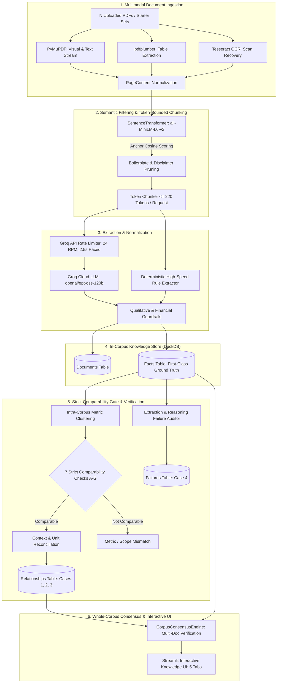

# Cross-Document Fact Knowledge Layer

> **A verifiable, multi-document knowledge extraction, contextual reconciliation, and consensus system.**  
> Grounded in strict intra-corpus isolation, rigorous comparability checks, and full multi-document provenance.

---

## 📑 Table of Contents
1. [Overview](#overview)
2. [Video Demo](#video-demo)
3. [Setup and Run Instructions](#setup-and-run-instructions)
   - [Local Development (UV / Python 3.12)](#local-development-uv--python-312)
   - [Docker & Docker Compose](#docker--docker-compose)
   - [How to Host for Public Access](#how-to-host-for-public-access)
4. [Approach & Architecture](#approach--architecture)
   - [End-to-End System Pipeline](#end-to-end-system-pipeline)
   - [The Four Core Verification Cases](#the-four-core-verification-cases)
   - [Strict Comparability Gate & Grounding Rules](#strict-comparability-gate--grounding-rules)
   - [Corpus Isolation & Multi-Document Consensus](#corpus-isolation--multi-document-consensus)
   - [AI Tools & Libraries Used](#ai-tools--libraries-used)
   - [Key Technical Decisions & Trade-Offs](#key-technical-decisions--trade-offs)
5. [Limitations and Next Steps](#limitations-and-next-steps)
6. [Additional Notes](#additional-notes)

---

## Overview

Corporate annual reports, earnings calls, prospectuses, and macroeconomic surveys frequently disclose metrics that appear contradictory on the surface. For example, a company might report Revenue as `8,142 Cr` in one document and `81,420 Mn` in another, or disclose `EBITDA` alongside `Adjusted EBITDA` and `Service EBITDA`. 

Traditional RAG and LLM systems fail here because:
1. **They compare soundalike metrics that are fundamentally non-comparable** (e.g. treating `EBITDA` and `Adjusted EBITDA Margin` as the same metric).
2. **They collapse facts into binary buckets**, discarding standalone ground truth that does not participate in contradictions.
3. **They only perform pairwise checks between two PDFs**, ignoring the wider consensus across $N$ documents in the corpus.
4. **They contaminate foreign corpora**, mixing corporate enterprise metrics with sovereign macroeconomics.

This project delivers a **first-class Fact Knowledge Layer** that extracts, validates, normalizes, stores, and reconciles atomic facts across arbitrary multi-PDF corpora with mathematical precision and explicit evidentiary provenance.

---

## Video Demo

https://github.com/user-attachments/assets/00aea928-1ff0-4db6-9758-cc2e0597747f

<p align="center">
  <a href="https://youtu.be/L9NJwAmpSaE">
    
  </a>
  <a href="https://github.com/Chirag-Jamariya/Fact-Knowledge-Layer/releases/download/v0.1.0/superjoin_demo.mp4">
    
  </a>
</p>

> 🎬 **Embedded Player**: Play the full walkthrough video directly above inside GitHub.  
> 🔗 **Alternative Links**: [Watch on YouTube](https://youtu.be/L9NJwAmpSaE) | [Download MP4 from Release v0.1.0](https://github.com/Chirag-Jamariya/Fact-Knowledge-Layer/releases/tag/v0.1.0)
>
> The video covers:
> 1. Ingestion and semantic fact extraction from multiple PDFs simultaneously.
> 2. Dynamic creation of a unified logical corpus with instant sidebar registration.
> 3. **Case 1 (Corroboration)**: Cross-document validation across corporate disclosures (e.g., INR Cr vs INR Mn normalized scale).
> 4. **Case 2 (Genuine Contradiction)**: Flagging incompatible factual assertions on the same metric, period, and scope.
> 5. **Case 3 (Context Reconciled)**: Automatic disambiguation of apparent contradictions caused by temporal drift, restatements, or accounting standards.
> 6. **Case 4 (Failure Analysis & Mitigation)**: Diagnosing and mitigating extraction anomalies (table header year flattening, layout merging) with audit trails.

---

## Setup and Run Instructions

### Local Development (UV / Python 3.12)

This project uses [uv](https://github.com/astral-sh/uv) for fast, deterministic dependency resolution.

#### 1. Prerequisites
- **Linux / macOS / WSL2**
- **Python 3.12**
- **Tesseract OCR & Poppler Utilities**:
  ```bash
  # Ubuntu / Debian
  sudo apt-get update && sudo apt-get install -y tesseract-ocr poppler-utils build-essential curl

  # macOS
  brew install tesseract poppler
  ```
- **uv**:
  ```bash
  curl -LsSf https://astral.sh/uv/install.sh | sh
  ```

#### 2. Clone and Setup Environment
```bash
git clone https://github.com/Chirag-Jamariya/fact-knowledge-layer.git
cd fact-knowledge-layer

# Create virtual environment and install dependencies
uv sync
```

#### 3. Configure Environment Variables
Create a `.env` file (or copy from `.env.example`):
```bash
cp .env.example .env
```
Populate your Groq API key:
```ini
GROQ_API_KEY=gsk_your_groq_api_key_here
GROQ_RPM_LIMIT=24.0
GROQ_MIN_INTERVAL_SECONDS=2.5
```
*(Note: If no Groq API key is provided, the platform automatically runs using the ultra-fast deterministic rule extraction engine).*

#### 4. Run the Streamlit Application
```bash
uv run streamlit run src/ui/app.py --server.port 8501
```
Open your browser at `http://localhost:8501`.

#### 5. Run the Automated Test Suite
```bash
uv run pytest
```

---

## Docker Image

[](https://github.com/Chirag-Jamariya/Fact-Knowledge-Layer/actions/workflows/docker.yml)
[](https://github.com/Chirag-Jamariya/Fact-Knowledge-Layer/pkgs/container/fact-knowledge-layer)

Published image:
```text
ghcr.io/chirag-jamariya/fact-knowledge-layer:latest
```

### Pull and Run from GHCR

Pull the pre-built, production-ready image from GitHub Container Registry:
```bash
docker pull ghcr.io/chirag-jamariya/fact-knowledge-layer:latest
```

Run the container:
```bash
docker run -d \
  -p 8501:8501 \
  -e GROQ_API_KEY="gsk_your_groq_api_key_here" \
  -v $(pwd)/data:/app/data \
  --name fact_knowledge_layer \
  ghcr.io/chirag-jamariya/fact-knowledge-layer:latest
```

---

### Docker & Docker Compose

Run the application in an isolated container without configuring local Python or system libraries.

#### Using Docker Compose (Recommended)
```bash
# Set your Groq API key in your terminal or .env file
export GROQ_API_KEY="gsk_your_groq_api_key_here"

# Build and start the container in detached mode
docker compose up -d --build
```
Access the application at `http://localhost:8501`.

#### Using Docker CLI (Local Build)
```bash
# Build the Docker image locally
docker build -t fact-knowledge-layer:local .

# Run the container
docker run -d \
  -p 8501:8501 \
  -e GROQ_API_KEY="gsk_your_groq_api_key_here" \
  -v $(pwd)/data:/app/data \
  --name fact_knowledge_layer \
  fact-knowledge-layer:local
```

---

### How to Host for Public Access

You can deploy this containerized application to several cloud platforms:

#### Option A: Streamlit Community Cloud (Zero-Cost & Instant)
1. Push your repository to GitHub.
2. Sign in to [share.streamlit.io](https://share.streamlit.io/).
3. Click **New app**, select repository `Chirag-Jamariya/fact-knowledge-layer`, branch `main`, and main file path `src/ui/app.py`.
4. In **Advanced Settings**, add `GROQ_API_KEY = "gsk_..."` under Secrets.
5. Deploy.

#### Option B: Render / Railway / Fly.io (Container Deployment)
- **Render**:
  1. Create a **New Web Service** connected to your GitHub repository.
  2. Select **Docker** environment.
  3. Under Environment Variables, set `GROQ_API_KEY` and `PORT=8501`.
  4. Render automatically builds and hosts the Docker image.
- **Railway**:
  1. `railway login` followed by `railway up`.
  2. Map port `8501` to public web domain.
- **Fly.io**:
  ```bash
  fly launch --port 8501
  fly secrets set GROQ_API_KEY="gsk_..."
  fly deploy
  ```

#### Option C: Hugging Face Spaces
1. Create a new Space with the **Docker** SDK.
2. Link your GitHub repo.
3. Add `GROQ_API_KEY` in Space Settings $\rightarrow$ Repository Secrets.
4. Set container port to `8501`.

---

## Approach & Architecture

### End-to-End System Pipeline



---

### The Four Core Verification Cases

The system categorizes and reasons over cross-document claims into four distinct analytical cases:

| Case | Title | Description | Concrete Example |
| :---: | :--- | :--- | :--- |
| **Case 1** | **Fact Corroborated Across Documents** | Same entity, metric, temporal period, and scope disclosed across $\ge 2$ documents. Values agree after automated unit normalization. | **Delhivery Revenue from Operations (FY24)**: Document 2 reports `8,142 Cr`, Document 3 reports `81,420 Mn`. Both resolve to `₹81,420,000,000` (100% agreement). |
| **Case 2** | **Genuine or Likely Contradiction** | Two facts pass all comparability tests (identical metric, period, unit, and scope) but state conflicting numerical or factual values without explanatory context. | **RBI vs Private Sector Inflation Projections**: Two documents report FY25 headline inflation under the same definition as `4.5%` vs `5.2%`. |
| **Case 3** | **Apparent Contradiction Reconciled by Context** | Discrepant values explained by explicit contextual shifts: temporal restatements, standalone vs consolidated reporting scopes, or changed accounting standards (Ind AS vs IFRS). | **Delhivery Express Parcel Volume**: FY22 reported at `577 Mn` in the 2022 Prospectus, later updated to `580 Mn` in the FY24 Annual Report due to post-IPO audited true-ups. |
| **Case 4** | **Extraction or Reasoning Failure Analysis & Mitigation** | Diagnoses pipeline anomalies (table header year flattening, ungridlined table layout collapses) and provides actionable architectural mitigations. | **Table Header Calendar Year Glitch**: Column header `2021` parsed as revenue value. Mitigated with AST regex guards `[12][0-9]{3}` and cell coordinate alignment. |

---

### Strict Comparability Gate & Grounding Rules

A core innovation in this project is the **Comparability Gate** (`src/reconciliation/comparability_gate.py`), which enforces seven strict checks (A through G) before any two facts are allowed to be compared:

1. **Entity Compatibility (Check A)**: Distinguishes sovereign states (e.g. Chad vs Niger) and distinct corporate entities.
2. **Soundalike Metric Differentiation (Check B)**: Strictly rejects false matches between metrics that sound similar but measure different things:
   - `EBITDA` $\ne$ `Adjusted EBITDA` $\ne$ `Reported EBITDA` $\ne$ `Service EBITDA`
   - `Revenue from Operations` $\ne$ `Revenue from Services` $\ne$ `Total Income`
   - `Real GDP Growth` $\ne$ `Oil GDP Growth` $\ne$ `Non-Oil GDP Growth`
3. **Value Nature / Ratio Consistency (Check C)**: Prevents percentage margins (e.g., `EBITDA Margin: 12%`) from being compared to absolute currency figures (e.g., `EBITDA: 500 Cr`).
4. **Temporal Scope Alignment (Check D)**: Verifies whether periods match, drift, or form consecutive fiscal quarters.
5. **Reporting Boundary Scope (Check E)**: Separates `Standalone` legal entities from `Consolidated` enterprise accounts.
6. **Accounting Standard Parity (Check F)**: Detects differences between `Ind AS`, `IFRS`, and `US GAAP`.
7. **Multi-Step Unit Normalization (Check G)**: Converts Indian numbering (`Crores`, `Lakhs`) and Western denominations (`Millions`, `Billions`) into base numeric values prior to delta calculations.

---

### Corpus Isolation & Multi-Document Consensus

1. **Strict Intra-Corpus Boundaries**: Facts belonging to `Delhivery` are never compared with facts from `India Macroeconomics` or custom user corpora. Reconciliations and failures are partitioned strictly by corpus.
2. **Whole-Corpus Verification**: Tab 4 features the `CorpusConsensusEngine`, which groups all facts across all PDFs in the active corpus into consensus clusters. A metric reported in 3 of 3 PDFs is flagged with highest consensus (`3 of 3 PDFs`), providing comprehensive coverage beyond simple 2-PDF pairs.
3. **Dynamic Batch Corpus Creation**: Users can upload $N$ arbitrary PDFs in the UI. The platform automatically clusters them into a single cohesive corpus, updates the sidebar dropdown, and dynamically activates the 5-tab analysis suite for the newly created corpus.

---

### AI Tools & Libraries Used

| Component | Tool / Library | Role & Rationale |
| :--- | :--- | :--- |
| **Inference Engine** | **Groq Cloud API** (`openai/gpt-oss-120b`) | High-speed structured fact extraction with rate-limiting and exponential backoff. |
| **Semantic Filtering** | **SentenceTransformers** (`all-MiniLM-L6-v2`) | Embeds and filters raw PDF pages against macroeconomic and corporate anchors to reject disclaimers and boilerplate before LLM prompting. |
| **PDF Extraction** | **PyMuPDF (`fitz`) & pdfplumber** | Dual-engine PDF extraction handling dual-column layouts, vector graphics, and tabular cell grids. |
| **OCR Recovery** | **Tesseract OCR (`pytesseract`)** | Optical character recognition fallback for scanned, rasterized, or unselectable text. |
| **Structured Storage** | **DuckDB** | Zero-dependency embedded analytical relational database with full ACID compliance and sub-millisecond query execution. |
| **Data Validation** | **Pydantic v2** | Strict typing, schema enforcement, and validation across all fact and reconciliation models. |
| **Interactive UI** | **Streamlit** | Multi-tab interactive user interface with real-time telemetry, filterable data tables, and comparability checklists. |

---

### Key Technical Decisions & Trade-Offs

1. **First-Class Knowledge Layer vs. Case-Only Filtering**:
   - *Decision*: Every fact extracted from every PDF is preserved in the database and accessible via Tab 2 ("All Facts"), even if it does not participate in any cross-document relationship.
   - *Trade-off*: Increases DuckDB storage footprint slightly, but prevents loss of unique standalone ground truth.
2. **Client-Side Sliding Window Rate Limiting**:
   - *Decision*: Enforced a 24 RPM sliding-window queue with 2.5s inter-request spacing and a 5-stage exponential backoff schedule (`3s, 8s, 13s, 17s, 23s`) for Groq API calls.
   - *Trade-off*: Extraction of 100-page documents takes several minutes under free-tier limits, but completely eliminates HTTP 429 failures. A fast deterministic rule-based extractor is provided as an instant fallback (~3s for 50 pages).
3. **Canonical Metric Normalization vs. Black-Box Vector Similarity**:
   - *Decision*: Replaced cosine-similarity clustering with canonical metric definition rules and the strict 7-point Comparability Gate.
   - *Trade-off*: Requires maintaining domain dictionaries of metric definitions, but prevents egregious errors (e.g. comparing EBITDA to Adjusted EBITDA).

---

## Limitations and Next Steps

### Current Limitations
1. **Complex Nested / Borderless Tables**: Multi-tier column hierarchies with merged cells across multiple rows can sometimes suffer from column misalignment during text extraction.
2. **Currency Exchange Volatility**: Metrics reported in distinct currencies (e.g. USD vs INR) over varying fiscal years require historical foreign exchange time-series tables for exact currency conversion.
3. **Scanned PDF Degradation**: Low-resolution scanned PDFs (< 150 DPI) can result in OCR noise in numerical values.

### Next Steps & Future Roadmap
1. **Vision-Language Model Ingestion (ColPali / Nougat)**: Integrate vision-based document decoders to parse borderless tables and complex flowcharts directly from page image renderings.
2. **Temporal Series Restatement Engine**: Build automated time-series alignment to trace historical restatement arcs across 5+ years of consecutive annual filings.
3. **Graph Neural Network (GNN) Provenance**: Model corporate relationships as a multi-relational knowledge graph to enable automated multi-hop reconciliation (e.g. tracing subsidiary revenues to parent consolidated disclosures).

---

## Additional Notes

- **Starter Datasets**: Pre-configured with 6 starter documents (3 corporate annual reports/prospectuses for Delhivery Limited, and 3 macroeconomic surveys for the Indian Economy from the Ministry of Finance, RBI, and IMF).
- **Test Suite Coverage**: 55 unit and integration tests covering PDF parsing, semantic chunking, rate limiting, comparability gating, DuckDB storage, multi-corpus batch synchronization, and UI rendering.
- **Reproducibility**: All starter datasets and cached fact representations are packaged and instantly loadable via the UI sidebar.

---

