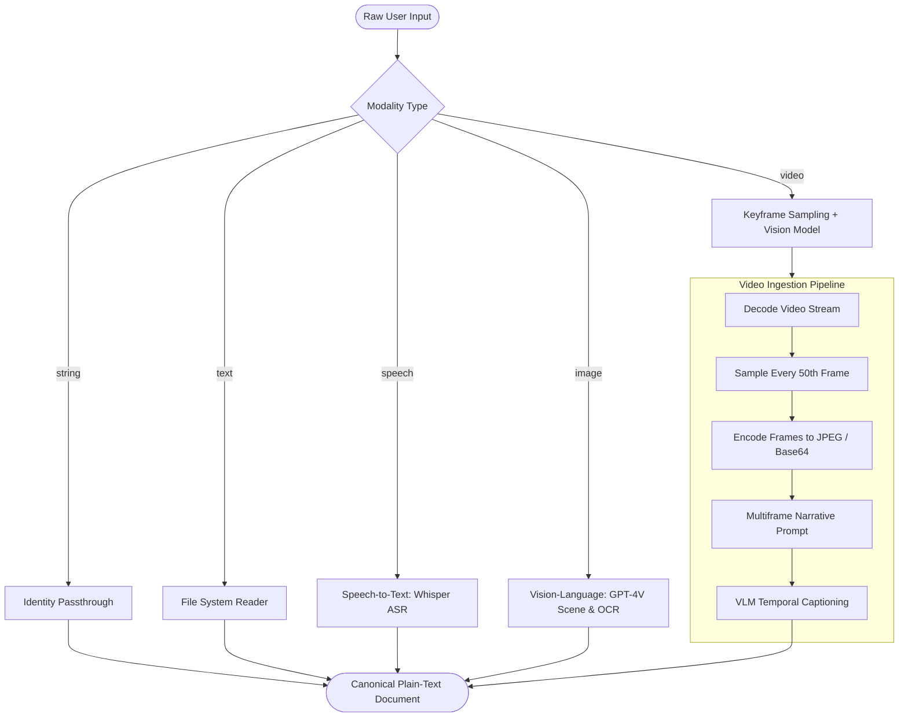

# Component 01: Multimodal Ingestion & Normalization Layer

## 1. Architectural Role & Purpose

Fact-checking verification engines, neural search retrievers, and natural language inference models operate fundamentally on discrete textual statements. However, real-world misinformation does not arrive solely as clean, well-formatted text; it proliferates across diverse sensory channels: audio podcasts, voice memos, social media screenshots, infographics, news clips, and short-form videos.

The **Multimodal Ingestion & Normalization Layer** acts as the canonical ingress adapter for Loki. Its logical purpose is to decouple downstream fact-verification modules from the complexities of sensory media. It translates heterogeneous multimodal artifacts into an unambiguous, semantically dense, and verifiable natural-language narrative.

---

## 2. Logical Flow & Ingestion Strategies

### 2.1 String & Plain-Text Normalization
- **Logic**: For raw strings or text files (`.txt`), the layer verifies encoding integrity and strips extraneous whitespace without altering underlying claims or rhetorical phrasing.
- **Output**: Direct UTF-8 textual representation.

### 2.2 Audio / Speech Decoding (`voice2text`)
- **Logical Challenge**: Spoken discourse contains conversational fillers, disfluencies, dialectal variations, and acoustic background noise.
- **Transformation Strategy**:
  1. Spoken audio streams are ingested in standard digital audio formats (`.mp3`, `.wav`, `.m4a`).
  2. The raw audio is processed through an automated speech recognition (ASR) foundation model (Whisper).
  3. The model reconstructs phonetic audio into grammatical, punctuated text, ensuring proper capitalization and sentence boundaries.
- **Logical Output**: A verbatim transcript capturing all spoken declarative statements.

### 2.3 Image Grounding & OCR (`image2text`)
- **Logical Challenge**: Images can convey claims through embedded graphic text (memes, infographics, screenshots of fake tweets) or visual context (doctored photos, miscaptioned historic events).
- **Transformation Strategy**:
  1. The image is read from the filesystem and serialized to high-resolution base64 encoding.
  2. A multimodal vision-language model (e.g., `gpt-4-vision-preview`) is prompted to inspect the image comprehensively.
  3. The model performs both **optical character recognition (OCR)** (extracting text written in the image) and **scene understanding** (describing actions, prominent figures, locations, and asserted events).
- **Logical Output**: A factual description summarizing what is visually depicted and what text is embedded within the image.

### 2.4 Video Temporal Summarization (`video2text`)
- **Logical Challenge**: Full video files contain thousands of redundant frames per minute, exceeding multimodal context windows while consuming immense bandwidth.
- **Transformation Strategy**:
  1. **Strided Temporal Sampling**: The video stream is read sequentially using computer vision decoders (`OpenCV`). Rather than passing every frame, the pipeline samples frames at uniform intervals (e.g., every 50th frame, capturing significant state changes while dropping redundant temporal duplicates).
  2. **Frame Serialization**: Extracted frames are normalized to standard resolution (e.g., max dimension 768px) and compressed into standard image formats.
  3. **Multi-Frame Temporal Fusion**: The ordered sequence of sampled frames is presented to a multimodal foundation model with instruction to synthesize a temporal narrative of events depicted across the timeline.
- **Logical Output**: A coherent natural-language narrative describing the events, claims, and spoken or displayed content of the video.

---

## 3. Logical Contracts & Interfaces

### Input Contract
- `modal`: Explicit modality enumeration: `"string"`, `"text"`, `"speech"`, `"image"`, or `"video"`.
- `input`: Raw text string or absolute path to the local multimedia artifact.
- `credentials`: API authentication credentials for perceptual models (e.g., OpenAI API key).

### Output Contract
- **Canonical Text (`str`)**: A single, self-contained, coherent plain-text string representing the factual content of the input artifact, ready for consumption by the downstream Claim Decomposition Engine.

---

## 4. Edge Cases & Architectural Robustness

| Failure Scenario | Logical Failure Mode | Mitigation Strategy |
|---|---|---|
| **Corrupted Video Stream** | OpenCV decoder fails to read valid frames (`success=False`). | Gracefully terminate frame loop; verify non-empty buffer before invoking vision model. |
| **Silent or Inaudible Audio** | ASR model yields empty transcription string. | Pipeline produces empty document warning; prevents downstream modules from processing null inputs. |
| **Dense Visual Text (Infographics)** | Image resolution downsampling renders text illegible. | Vision model processes high-detail payload mode (`detail: auto / high`) to preserve text legibility. |
| **Large Audio Files** | Exceeds single API payload upload threshold. | Handled via standard compressed audio format inputs (`mp3`) prior to speech ingestion. |
