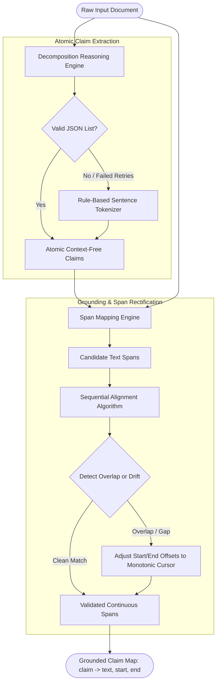

# Component 02: Claim Decomposition & Source Span Grounding

## 1. Architectural Role & Purpose

Real-world narratives rarely present facts in clean, isolated, single-predicate sentences. An author might write:
> *"Founded in 2019 by Dr. Smith, the Abu Dhabi-based startup secured $50M in Series A funding, outperforming its regional rivals."*

This single sentence contains at least four distinct factual propositions:
1. The company was founded in 2019.
2. Dr. Smith founded the company.
3. The company is based in Abu Dhabi.
4. The company secured $50M in Series A funding.

Evaluating the entire sentence as a single unit is flawed: if the company was indeed founded in 2019 by Dr. Smith in Abu Dhabi, but the funding was $20M instead of $50M, a binary verdict on the whole sentence would either mark truthful assertions as false or overlook inaccurate figures.

The **Claim Decomposition & Source Grounding Engine (`Decompose`)** solves this granularity mismatch. It performs two interdependent logical operations:
1. **Atomic Claim Extraction (`getclaims`)**: Dissecting narrative paragraphs into independent, context-free, self-contained atomic factual units.
2. **Document Grounding & Span Restoration (`restore_claims`)**: Mapping each atomic claim back to its exact character span `[start, end]` in the original source document, preserving full auditability and highlighting capability.



---

## 2. Logical Strategy 1: Atomic Claim Extraction (`getclaims`)

### 2.1 Core Rules of Atomicity
To enable reliable downstream web search and verification, each extracted claim must adhere to four strict logical constraints:
1. **Single Proposition (Atomicity)**: Each claim must express exactly one factual assertion. Compound sentences joined by conjunctions ("and", "while", "because") are separated.
2. **Context Independence (Coreference Resolution)**: Decontextualized claims cannot contain vague relative pronouns (e.g., "he", "it", "the institution", "she"). All referents must be resolved to their explicit proper nouns (e.g., "Albert Einstein", "Microsoft Corporation").
3. **Conciseness**: Claims must be compact (typically under 15 words) to avoid carrying irrelevant conversational framing or hedging words ("probably", "it is widely believed").
4. **Exhaustiveness**: Every single sentence in the source text must contribute at least one atomic claim to ensure zero factual loss.

### 2.2 Extraction & Fallback Safety Net
- The engine prompts the model to return a structured JSON object containing a `"claims"` list.
- **Retry Mechanism**: If the output format is malformed or invalid JSON, the engine retries up to $N$ times (varying the generation seed).
- **Graceful Fallback**: If the model repeatedly fails to produce valid structured claims, the engine falls back to a deterministic linguistic sentence tokenizer (`nltk.sent_tokenize`). While sentence tokenization does not fully isolate atomic sub-clauses, it guarantees pipeline continuity without terminating the fact-check run.

---

## 3. Logical Strategy 2: Source Span Grounding (`restore_claims`)

### 3.1 The Traceability Problem
Once claims are rephrased into standalone atomic statements, they differ syntactically from the source document. For user interfaces (e.g., visual claim highlighting in web apps) and provenance tracking, the system must know:
- *Which specific slice of text in the original document generated this atomic claim?*
- *What are its character start and end indices?*

### 3.2 The Geometric Span Rectification Algorithm
The engine prompts the model to assign each atomic claim to its corresponding raw substring from the document. However, generative models can hallucinate slight variations, misalign punctuation, or produce overlapping boundaries.

To ensure strict geometric coherence across the document canvas, Loki executes a **Monotonic Boundary Alignment Algorithm**:
1. **Substring Matching**: Locate the initial character index of the candidate substring within the raw document:
   $$\text{start} = \text{doc.find}(\text{substring}), \quad \text{end} = \text{start} + \text{len}(\text{substring})$$
2. **Monotonic Cursor Enforcement**: Maintain a global cursor `cur_pos` tracking the end offset of the previously committed claim:
   - **Case 1 (Preceding Collision)**: If a span starts before the current cursor ($\text{start} < \text{cur\_pos} + 1$) but extends past it, its start index is truncated forward to $\text{cur\_pos} + 1$.
   - **Case 2 (Total Shadowing)**: If a span starts and ends before or inside the current cursor ($\text{end} \le \text{cur\_pos}$), it is marked as shadowed and collapsed to avoid backward jumps.
   - **Case 3 (Gap Bridging)**: If a span starts beyond the current cursor ($\text{start} > \text{cur\_pos} + 1$), the start index is extended backward to $\text{cur\_pos} + 1$ to preserve continuous, non-gapped coverage across the document.
3. **Slice Validation**: The resulting offsets are extracted directly as `doc[start:end]` to guarantee that concatenating all spans reconstructs the continuous text.

---

## 4. Input & Output Contracts

### Input Contract
- `doc`: The full normalized raw text string.
- `num_retries`: Maximum retry attempts for structured response generation (default: 3).

### Output Contract
- **Atomic Claims**: A list of strings `[claim_1, claim_2, ..., claim_k]`.
- **Grounded Spans Map**: A dictionary mapping each claim string to its spatial metadata:
  ```json
  {
    "Mary likes playing piano.": {
      "text": "she likes playing piano",
      "start": 32,
      "end": 55
    }
  }
  ```
