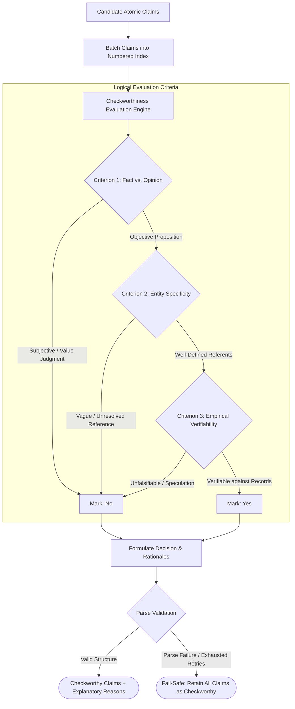

# Component 03: Checkworthiness Filtering Engine

## 1. Architectural Role & Purpose

Not every sentence uttered or written by a human is a factual claim, and not every factual claim is checkworthy. Consider these statements:
- *"Vanilla ice cream is the best dessert in the world."* (Subjective opinion / aesthetic preference)
- *"He was an intelligent and kind student."* (Ambiguous evaluation without named referent)
- *"Stock markets will likely experience a downturn next year."* (Future prediction / speculation)
- *"The UAE founded MBZUAI in 2019."* (Objective, verifiable historical fact)

Subjecting opinions or predictions to search engines and NLI judges results in nonsensical verdicts: search engines return contradictory debate articles, and verification models produce false refutations. Furthermore, querying web search APIs and crawling pages for unverifiable claims introduces significant financial, latency, and computational waste.

The **Checkworthiness Filtering Engine (`Checkworthy`)** serves as a strategic gatekeeper. Its purpose is to evaluate every atomic claim extracted from the decomposition phase and determine whether it represents an empirically verifiable statement of fact.



---

## 2. Logical Evaluation Criteria

The filter systematically audits each claim against three interdependent criteria:

### 2.1 Criterion 1: Opinions vs. Facts
- **Objective Fact**: A statement asserting an empirical state of the world that is independent of personal tastes, moral stances, or emotional attitudes. Even if the statement is factually incorrect (e.g., *"The moon is made of green cheese"*), it is checkworthy because its truth value can be objectively refuted.
- **Subjective Opinion**: Statements expressing value judgments, emotional states, aesthetics, or moral assessments (e.g., *"The movie was exhilarating and masterfully paced"*). Such statements cannot be verified or falsified by empirical evidence.

### 2.2 Criterion 2: Clarity & Referential Specificity
- A statement must possess sufficient contextual grounding for an external investigator to locate evidence.
- Statements that lack named entities or context-free anchors (e.g., *"He was born in that hospital"* or *"The company made billions"*) are rejected as uncheckworthy because the entity cannot be resolved against open-domain knowledge bases without additional co-text.

### 2.3 Criterion 3: Verifiability & Falsifiability
- Does there exist a plausible historical record, scientific measurement, public registry, or authoritative publication against which this claim can be checked?
- Predictions about future events (e.g., *"AI will achieve superintelligence by 2030"*) or metaphysical assertions are classified as non-verifiable.

---

## 3. Decision Structure & Fallback Logic

### 3.1 Structured Pairwise Output
The engine requires the model to output a dual-field evaluation for each statement:
- **Decision Prefix**: Explicit binary classifier (`"Yes"` or `"No"`).
- **Reasoning Suffix**: A concise, audit-friendly rationale explaining the decision.

Example mapping:
```json
{
  "Gary Smith is a distinguished professor of economics.": "Yes (The statement contains verifiable factual information about Gary Smith's professional title and field.)",
  "He is a professor at MBZUAI.": "No (The statement cannot be verified due to the lack of clear reference to who 'he' is.)",
  "MBZUAI offers an exceptionally beautiful environment.": "No (The statement expresses a subjective aesthetic opinion.)"
}
```

### 3.2 Fail-Safe Fallback Mechanism
In automated fact verification, **a false negative (failing to check a false claim because it was accidentally dropped) is far more hazardous than a false positive (checking an opinion)**.

Therefore, if the model returns unparseable output or fails after maximum retry attempts ($N=3$), Loki activates a fail-safe rule:
- **Fallback Policy**: All input claims are conservatively assumed to be checkworthy, ensuring that no potential misinformation escapes downstream investigation due to a filtering error.

---

## 4. Input & Output Contracts

### Input Contract
- `texts`: A list of candidate atomic claim strings `[claim_1, claim_2, ..., claim_k]`.
- `num_retries`: Maximum generation retry attempts (default: 3).

### Output Contract
- **`checkworthy_claims` (`list[str]`)**: The filtered subset of claims that passed the verification audit.
- **`claim2checkworthy` (`dict[str, str]`)**: A complete lookup dictionary mapping *every* input claim to its decision and explicit explanatory rationale.
