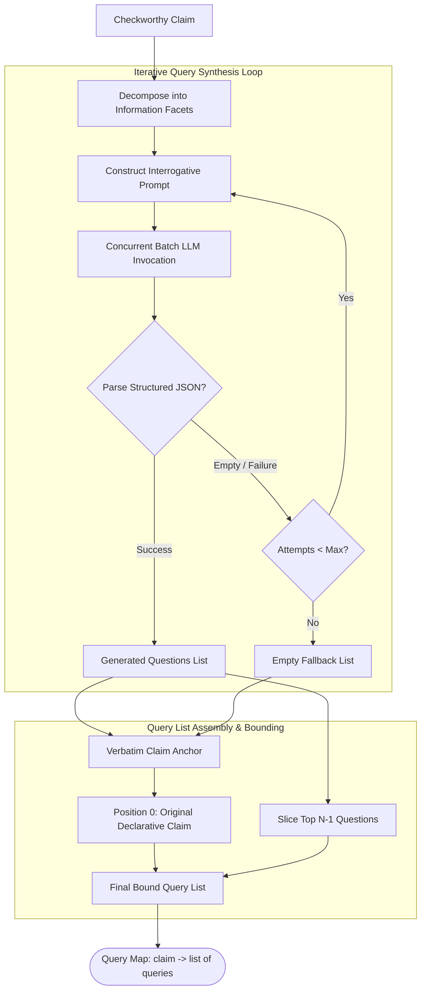

# Component 04: Search Query Generation Engine

## 1. Architectural Role & Purpose

Submitting raw, declarative factual claims directly to web search engines often yields sub-optimal information retrieval. For example:
- Raw Claim: *"The Havel-Hakimi algorithm is an algorithm for converting the adjacency matrix of a graph into its adjacency list."*
- If submitted verbatim, a search engine may match web pages containing the words "Havel-Hakimi algorithm" and "adjacency list" without addressing whether one converts into the other.

Web search engines and knowledge retrieval systems are optimized for **interrogative information-seeking queries** (e.g., *"What does the Havel-Hakimi algorithm do?"* or *"Who is the Havel-Hakimi algorithm named after?"*). 

The **Search Query Generation Engine (`QueryGenerator`)** bridges this semantic gap. Its logical purpose is to synthesize a set of targeted, orthogonal search queries for each checkworthy claim, ensuring comprehensive external evidence discovery.



---

## 2. Logical Strategy & Query Synthesis

### 2.1 Declarative-to-Interrogative Transformation
The engine decomposes the claim into its primary factual assertions (the subject, predicate, temporal frame, numerical quantity, or causal link) and formulates the minimum number of precise questions required to establish its truth:
- **Predicate Question**: *"What is the function of [Subject]?"*
- **Origin / Attribution Question**: *"Who created or founded [Subject]?"*
- **Location / Temporal Question**: *"Where was [Event] conducted?"* / *"When did [Event] occur?"*

### 2.2 Asynchronous Parallel Dispatch (`multi_call`)
Fact verification frequently involves multiple checkworthy claims simultaneously. Sending individual sequential requests to language models would introduce unacceptable latency. The Query Generator:
1. Formulates prompt payloads for all claims concurrently.
2. Dispatches them via asynchronous execution (`multi_call`).
3. Evaluates returned payloads, selectively retrying only the subset of claims for which question parsing failed or returned empty lists.

---

## 3. The Verbatim Anchor & Recall Guarantee

While interrogative questions excel at discovering conceptual explanations, exact declarative strings excel at locating authoritative fact-checking databases (e.g., Snopes, PolitiFact, Wikipedia titles) that index the exact myth or debunked quote.

To maximize search recall across both retrieval modalities, Loki implements the **Verbatim Anchor Strategy**:
1. **Primary Anchor (Slot 0)**: The original declarative claim is unconditionally prepended as the very first search query.
2. **Exploratory Facets (Slots 1 to $K-1$)**: The top generated interrogative questions are appended up to the configured limit `max_query_per_claim` (default: 5).

$$\text{Final Queries}(c) = [c] \cup \text{Questions}(c)_{[0 : K-1]}$$

This architecture guarantees that:
- Every claim is guaranteed at least one high-precision search query even if question generation completely fails.
- The downstream evidence crawler receives a strictly bounded, non-exploding number of queries per claim, preventing search engine rate exhaustion.

---

## 4. Input & Output Contracts

### Input Contract
- `claims`: A list of checkworthy atomic claim strings.
- `max_query_per_claim`: Maximum number of search queries allocated per claim (default: 5).
- `generating_time`: Maximum retry rounds for unparsed questions (default: 3).

### Output Contract
- **`claim_query_dict` (`dict[str, list[str]]`)**: A dictionary mapping each claim to its prioritized query list:
  ```json
  {
    "The Stanford Prison Experiment was conducted in Encina Hall.": [
      "The Stanford Prison Experiment was conducted in Encina Hall.",
      "Where was Stanford Prison Experiment conducted?",
      "Was the Stanford Prison Experiment held in Encina Hall?"
    ]
  }
  ```
