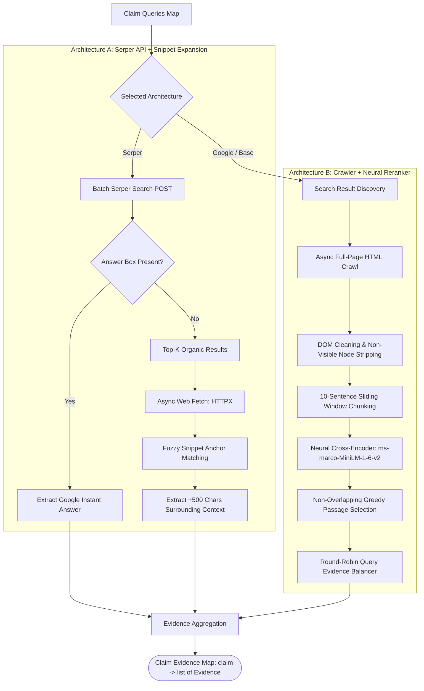

# Component 05: Evidence Retrieval & Information Extraction Engine

## 1. Architectural Role & Purpose

Fact verification cannot rely solely on the internal parametric weights of an LLM, as models hallucinate, suffer knowledge cutoffs, and exhibit sycophancy. Authoritative verification requires **retrieval-grounded external evidence** gathered from the open web.

However, web retrieval presents severe architectural challenges:
- **Search Snippet Truncation**: Commercial search APIs return small snippets (100–150 characters), which frequently cut off critical qualifications (e.g., returning *"...the senator stated that he did not..."* truncated before the predicate).
- **Webpage Noise**: 80% of an HTML webpage consists of navigational menus, cookie banners, advertisements, tracking scripts, and boilerplate text.
- **Redundancy vs. Coverage**: Multiple search queries can return identical passages or flood the pipeline with near-duplicate sentences.

The **Evidence Retrieval Engine (`Retriever`)** gathers, filters, expands, and ranks web-scale evidence to supply verifiable, context-rich passages to the downstream verification judge.



---

## 2. Architecture A: API Retrieval with Dynamic Context Expansion (`SerperEvidenceRetriever`)

### 2.1 Google Answer Box Fast-Path
For common encyclopedic questions (e.g., *"Where is the capital of Australia?"*), search engines surface a curated **Google Answer Box**. The Serper retriever inspects the response headers for this fast-path:
- If present, the instant answer is extracted immediately as high-priority evidence (`url: "Google Answer Box"`).
- This bypasses unnecessary crawling, reducing latency by up to 85%.

### 2.2 Dynamic Snippet Context Expansion
When no answer box exists, standard search snippets are retrieved. Because snippets are typically incomplete fragments, Loki executes an active **Context Expansion Protocol**:
1. **Parallel Web Scraping**: The engine initiates asynchronous HTTP requests (`httpx.AsyncClient` with connection pooling) to fetch the destination HTML of the top search results.
2. **Fuzzy Anchor Matching**: BeautifulSoup parses the visible text. The engine locates the original snippet inside the full text using an anchor prefix:
   $$\text{Anchor} = \text{Snippet}[:-10]$$
3. **Contextual Expansion Window**: Once located, the snippet is dynamically expanded by taking up to 500 characters of trailing co-text:
   $$\text{Expanded Passage} = \text{Text}[\text{start} : \text{end} + 500] + \text{" ..."}$$
4. If a target page blocks scraping or returns non-HTML binaries (e.g., `.pdf`), the engine falls back safely to the original unexpanded snippet.

---

## 3. Architecture B: Deep Scraping & Neural Reranking (`BaseRetriever`)

When operating without third-party snippet APIs, Loki employs a self-contained crawling and dense neural reranking pipeline:

### 3.1 DOM Boilerplate Stripping
Web HTML is parsed via `BeautifulSoup`. All invisible and non-content tags are stripped:
$$\text{Excluded Tags} \in \{\text{script}, \text{style}, \text{head}, \text{title}, \text{meta}, \text{comment}\}$$
The remaining visible text tokens are normalized to single-space continuous prose.

### 3.2 Linguistic Sliding-Window Chunking
Long-form web pages are segmented into candidate passages using a Spacy-driven sliding window:
- **Window Size**: 10 full sentences per passage.
- **Stride (Step Size)**: 8 sentences (creating an intentional 2-sentence overlap to preserve transitional context across chunk boundaries).
- **Length Filters**: Sentences shorter than 3 characters or longer than 250 characters (typically table dumps or code fragments) are filtered out.

### 3.3 Neural Cross-Encoder Passage Reranking
Rather than relying solely on lexical BM25 matching, each candidate passage $p$ is paired with the query $q$ and evaluated by a pretrained neural Cross-Encoder model (`cross-encoder/ms-marco-MiniLM-L-6-v2`):
$$\text{Relevance Score} = \text{CrossEncoder}(q, p)$$

### 3.4 Non-Overlapping Information Maximization
Top passages are sorted by relevance score. A greedy algorithm selects passages while enforcing a strict **non-overlap constraint**:
- If candidate passage $p_j$ geometrically overlaps in sentence indices with an already-selected higher-scoring passage $p_i$, $p_j$ is discarded.
- This ensures that retrieved evidence contains distinct, complementary information rather than repetitive excerpts from the same paragraph.

### 3.5 Round-Robin Evidence Interleaving
To prevent one search query from monopolizing the evidence quota, the engine aggregates candidate passages across all generated sub-queries in a **round-robin schedule**, assembling a balanced evidence portfolio (top 5 passages) per claim.

---

## 4. Input & Output Contracts

### Input Contract
- `claim_queries_dict`: A dictionary mapping each claim to its list of search queries.
- `top_k`: Number of search results inspected per query (default: 3).

### Output Contract
- **`claim_evidence_dict` (`dict[str, list[dict]]`)**: A dictionary mapping each claim to a list of evidence dictionaries:
  ```json
  {
    "MBZUAI is located in Abu Dhabi.": [
      {
        "text": "MBZUAI is a graduate-level research university located in Masdar City, Abu Dhabi, United Arab Emirates...",
        "url": "https://mbzuai.ac.ae/about/",
        "retrieval_score": 0.892
      }
    ]
  }
  ```
