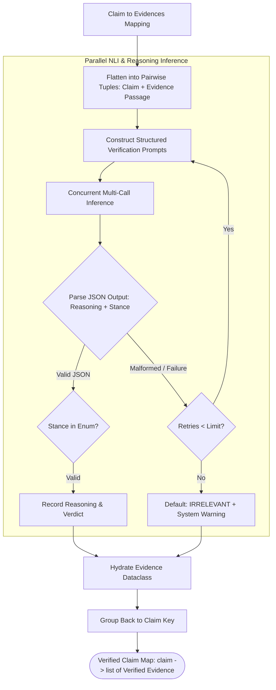

# Component 06: Claim Verification & Stance Reasoning Engine

## 1. Architectural Role & Purpose

Collecting relevant evidence does not automatically determine whether a claim is true or false. A search query for *"Copper reacts with ferrous sulfate"* may retrieve a physics textbook passage stating:
> *"Copper is less reactive than iron and has a positive standard reduction potential; hence copper cannot displace iron from ferrous sulphate solution."*

An automated system must analyze the semantic entailment relationship between this evidence and the original claim to discern whether the passage confirms or disproves the assertion.

The **Claim Verification & Stance Reasoning Engine (`ClaimVerify`)** performs this judgment. Formulated as an advanced **Natural Language Inference (NLI) with Chain-of-Thought** reasoning task, it inspects each claim against each retrieved evidence passage to classify their relationship and formulate an interpretable justification.



---

## 2. Logical Formulation & Pairwise Reasoning

### 2.1 The Pairwise Decomposition Principle
Rather than feeding an entire bundle of 10 disparate web passages into a single massive LLM prompt, Loki evaluates claims **strictly pairwise**:
$$(c_i, e_{i,j}) \xrightarrow{\text{NLI Judge}} (\text{Relationship}, \text{Reasoning})$$

**Why Pairwise Evaluation is Superior**:
- **Prevents Lost-in-the-Middle Attention Bias**: In long multi-passage contexts, models often overlook a refuting sentence buried between nine supporting sentences.
- **Granular Attribution**: Every single evidence item retains its own independent stance and dedicated rationale. Users can audit exactly why a specific URL was judged as supporting or refuting.
- **Independent Parallelization**: Pairwise prompts are completely independent and execute in parallel across high-concurrency threads.

### 2.2 The Tri-State Stance Taxonomy
The engine enforces a rigorous, mutually exclusive tri-state classification:

| Stance Label | Logical Definition | Verification Rule |
|---|---|---|
| `SUPPORTS` | Positive Entailment | The evidence passage directly affirms the factual truth of the claim's core predicate. |
| `REFUTES` | Contradiction / Falsification | The evidence passage directly denies, contradicts, or demonstrates the factual impossibility of the claim. |
| `IRRELEVANT` | Neutral / Orthogonal | The evidence mentions related keywords but does not provide sufficient information to prove or disprove the claim. |

### 2.3 Transparent Chain-of-Thought Reasoning
Loki explicitly mandates that the verification engine synthesize its natural language `reasoning` justification *before* emitting the categorical `relationship` label. 

This ordering leverages autoregressive conditioning: by articulating the factual comparison step-by-step, the model grounds its final classification in logical deductions rather than probabilistic label guessing.

Example structured output:
```json
{
  "reasoning": "The evidence confirms that copper cannot displace iron from ferrous sulphate solution and no change will take place. Therefore, the evidence directly contradicts the claim that copper reacts with ferrous sulfate.",
  "relationship": "REFUTES"
}
```

---

## 3. Robustness & Fault Tolerance

In the event of network timeouts, API rate drops, or unparseable responses after all retry attempts ($N=3$), the engine applies a **Neutral Fail-Safe Policy**:
- **Fallback Assignment**:
  - `relationship`: `"IRRELEVANT"`
  - `reasoning`: `"[System Warning] Can not identify the factuality of the claim."`
- **Design Rationale**: Assigning a neutral `"IRRELEVANT"` stance ensures that an unresolvable evidence passage is omitted from the mathematical truth calculation without falsely biasing the score toward either support or refutation.

---

## 4. Input & Output Contracts

### Input Contract
- `claim_evidences_dict`: A dictionary mapping each claim string to its list of retrieved raw evidence dictionaries `[evidence_1, evidence_2, ...]`.

### Output Contract
- **`claim_verifications_dict` (`dict[str, list[Evidence]]`)**: A dictionary mapping each claim to a list of fully verified `Evidence` objects containing:
  - `claim`: Target claim text.
  - `text`: Excerpted evidence passage.
  - `url`: Origin source URL or Answer Box indicator.
  - `reasoning`: Natural language justification.
  - `relationship`: `"SUPPORTS"`, `"REFUTES"`, or `"IRRELEVANT"`.
