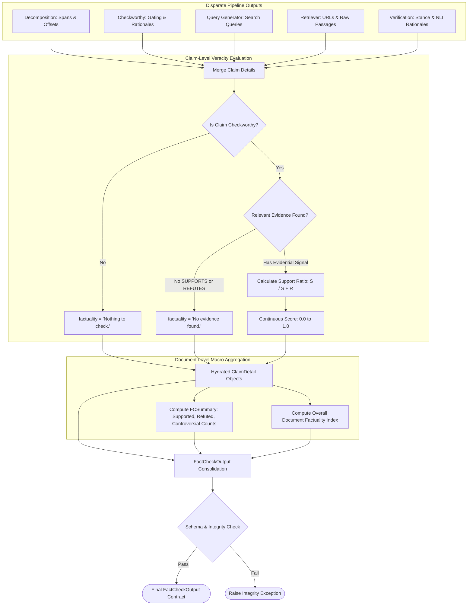

# Component 07: Factuality Synthesis & Metrics Aggregation Layer

## 1. Architectural Role & Purpose

At the end of the pipeline, the system possesses a mosaic of disparate analytical artifacts:
- Character span coordinates and original sentences from **Decomposition**.
- Binary gating decisions and rationales from **Checkworthiness**.
- Search queries generated from **Query Formulation**.
- URLs, scraped text passages, and retrieval scores from **Evidence Retrieval**.
- Stance labels (`SUPPORTS`, `REFUTES`, `IRRELEVANT`) and natural language justifications from **Claim Verification**.

The **Factuality Synthesis & Metrics Aggregation Layer** binds these heterogeneous data streams into a unified, mathematically coherent, and auditable data structure. It computes local claim-level veracity scores, document-wide macro reliability metrics, and preserves complete spatial provenance for downstream applications and UI visualization.



---

## 2. Claim-Level Factuality Scoring Logic

For every decomposed claim $c_i$, the synthesis layer assesses its evidence portfolio to assign an unambiguous truth status:

### 2.1 Case 1: Non-Checkworthy Statements
- **Condition**: Claim was rejected during checkworthiness filtering (e.g., subjective opinions, ambiguous statements).
- **Veracity Value**: Assigned the categorical label `"Nothing to check."`.
- **Handling**: Evidence and query lists are left empty; checkworthiness rationale is preserved.

### 2.2 Case 2: Unverified Claims (Information Void)
- **Condition**: Claim was checkworthy, queries were executed, but no retrieved passage yielded a `SUPPORTS` or `REFUTES` stance (all evidence was either absent or judged `IRRELEVANT`).
- **Veracity Value**: Assigned the categorical label `"No evidence found."`.
- **Handling**: Indicates that open-world search did not uncover conclusive data.

### 2.3 Case 3: Verified Claims (Continuous Support Ratio)
- **Condition**: Claim has at least one evidence passage asserting `SUPPORTS` or `REFUTES`.
- **Mathematical Formulation**: The veracity is computed as the bounded continuous ratio of supporting evidence count to total definitive evidence count:
  $$\text{Factuality}(c_i) = \frac{N_{\text{SUPPORTS}}}{N_{\text{SUPPORTS}} + N_{\text{REFUTES}}} \in [0.0, 1.0]$$

**Veracity Spectrum**:
- **$\text{Factuality} = 1.0$ (Fully Supported)**: Unanimous consensus among retrieved evidence affirming the claim.
- **$\text{Factuality} = 0.0$ (Fully Refuted)**: Unanimous consensus among retrieved evidence contradicting the claim.
- **$0.0 < \text{Factuality} < 1.0$ (Controversial / Disputed)**: Conflicting evidence exists across credible sources, indicating ongoing debate, mixed reporting, or ambiguous definitions.

---

## 3. Document-Level Macro Metrics (`FCSummary`)

To provide an executive-level summary of an entire document or article, the aggregator computes document-wide macro statistics:

| Metric Name | Logical Definition |
|---|---|
| `num_claims` | Total number of atomic claims extracted from the document. |
| `num_checkworthy_claims` | Count of claims identified as verifiable facts. |
| `num_verified_claims` | Count of claims where definitive supporting or refuting evidence was located. |
| `num_supported_claims` | Verified claims with $\text{Factuality} = 1.0$. |
| `num_refuted_claims` | Verified claims with $\text{Factuality} = 0.0$. |
| `num_controversial_claims` | Verified claims with mixed evidence ($0.0 < \text{Factuality} < 1.0$). |
| `factuality` | Macro veracity index: arithmetic mean of veracity scores across all verified claims: $$\text{DocFactuality} = \frac{1}{|\mathcal{V}|} \sum_{c \in \mathcal{V}} \text{Factuality}(c)$$ *(where $\mathcal{V}$ is the set of verified claims)*. |

---

## 4. Complete Structured Data Contract

The pipeline terminates by producing a strongly typed `FactCheckOutput` dataclass:

```json
{
  "raw_text": "Full document string...",
  "token_count": 482,
  "usage": {
    "decomposer": {"model": "gpt-4o", "prompt_tokens": 512, "completion_tokens": 120},
    "checkworthy": {"model": "gpt-4o", "prompt_tokens": 480, "completion_tokens": 85},
    "query_generator": {"model": "gpt-4o", "prompt_tokens": 620, "completion_tokens": 140},
    "evidence_crawler": {"model": "gpt-4o", "prompt_tokens": 0, "completion_tokens": 0},
    "claimverify": {"model": "gpt-4o", "prompt_tokens": 1420, "completion_tokens": 310}
  },
  "claim_detail": [
    {
      "id": 0,
      "claim": "Mary is five years old.",
      "checkworthy": true,
      "checkworthy_reason": "Verifiable biographical datum.",
      "origin_text": "Mary is a five-year old girl,",
      "start": 0,
      "end": 28,
      "queries": ["Mary is five years old.", "How old is Mary?"],
      "evidences": [
        {
          "claim": "Mary is five years old.",
          "text": "Mary celebrated her 5th birthday yesterday with family.",
          "url": "https://example.com/bio",
          "reasoning": "Evidence directly affirms Mary turned 5.",
          "relationship": "SUPPORTS"
        }
      ],
      "factuality": 1.0
    }
  ],
  "summary": {
    "num_claims": 5,
    "num_checkworthy_claims": 4,
    "num_verified_claims": 3,
    "num_supported_claims": 2,
    "num_refuted_claims": 1,
    "num_controversial_claims": 0,
    "factuality": 0.67
  }
}
```
