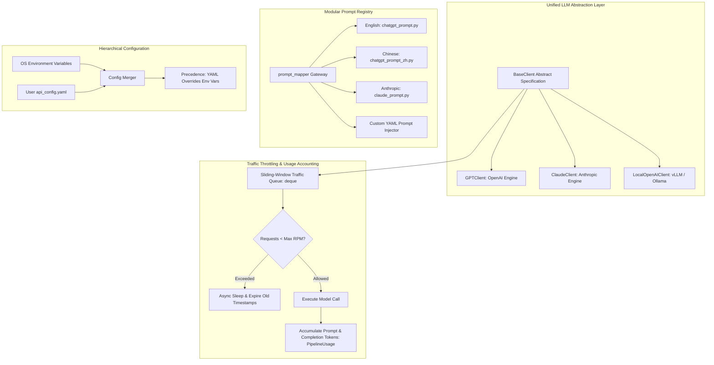

# Component 08: Infrastructure & Cross-Cutting Subsystems

## 1. Architectural Role & Purpose

A multi-stage fact verification pipeline requires robust supporting infrastructure to manage rate limits, model heterogeneity, token economics, concurrency, and multilingual adaptations. If an LLM client hangs on a rate limit or a model switch requires rewriting pipeline stages, the architecture becomes fragile and unmaintainable.

The **Infrastructure & Cross-Cutting Subsystems** provide the foundational layer that powers Loki:
1. **Unified LLM Client Abstraction**: A polymorphic adapter standardizing interactions across cloud and self-hosted models.
2. **Sliding-Window Rate Limiter & Token Accounting**: Dynamic traffic throttling and per-component cost auditability.
3. **Multi-Stage Concurrency & Pipeline Parallelism**: Asynchronous task orchestration maximizing throughput.
4. **Decoupled Prompt Management System**: Plug-and-play multilingual and model-specific prompt templates.
5. **Hierarchical Configuration Manager**: Unified credentials and runtime parameter management.



---

## 2. Unified LLM Client Abstraction Layer

### 2.1 Polymorphic Interface
Different foundation model APIs utilize distinct SDK structures, JSON formatting parameters, and role conventions. Loki standardizes all LLM providers through an abstract interface (`BaseClient`):
- `construct_message_list(prompts)`: Converts raw instruction strings into provider-specific message payloads (system/user formatting).
- `call(messages)`: Synchronous single-message invocation with automatic retry on transient socket errors.
- `multi_call(messages_list)`: Asynchronous parallel batch invocation using event loops and non-blocking executors.

### 2.2 Sliding-Window Rate Limiter
When verifying multiple claims and evidence pairs in parallel, API calls can trigger provider rate limit errors (`429 Too Many Requests`).

To guarantee smooth throughput, `BaseClient` maintains a **sliding-window timestamp queue**:
- A queue `traffic_queue = deque()` tracks each dispatched request timestamp `(time, request_length)`.
- Before dispatching a new request, old records exceeding the evaluation window (`request_window = 60s`) are expired.
- If current active requests exceed `max_requests_per_minute` (e.g., 200 RPM), the client asynchronously sleeps until capacity frees up.

### 2.3 Fine-Grained Token Accounting
Fact checking is computationally and financially intensive. Loki instruments every LLM client to record granular token usage across all lifecycle steps:
- Usage is tracked individually for each pipeline module (`decomposer`, `checkworthy`, `query_generator`, `evidence_crawler`, `claimverify`).
- Results are aggregated into the `PipelineUsage` dataclass, providing complete visibility into prompt and completion token expenditures per verification run.

---

## 3. Concurrency & Pipeline Parallelism

Loki applies concurrency at multiple granularities to minimize end-to-end pipeline latency:

```
Step 1: Decompose
        │
        ├─── Parallel ThreadPool ────────────────────────┐
        │                                                │
        ▼                                                ▼
Step 1B: Span Grounding          Step 2: Checkworthy          Step 3: Query Gen
        │                                                │
        └───────────────────────┬────────────────────────┘
                                ▼
                         Synchronization & Pruning Gate
                                │
                                ▼
Step 4: Evidence Retrieval (Async HTTP Web Crawl + Multiprocess Scraping)
                                │
                                ▼
Step 5: Claim Verification (Async Multi-Call Pairwise Inference)
                                │
                                ▼
Step 6: Factuality Synthesis & Aggregation
```

1. **Step 1B, 2, and 3 Concurrency**: Because Span Grounding, Checkworthiness, and Query Generation depend exclusively on the output of Step 1 (Decomposition), they are executed **concurrently in a thread pool executor**, saving significant wall-clock latency.
2. **Web Crawling & Parsing**: Web pages are fetched asynchronously via `httpx` async coroutines, while CPU-heavy HTML parsing is distributed across worker processes (`ProcessPoolExecutor`).
3. **Claim Verification Batching**: All claim-evidence pairs are dispatched in a single unified async batch (`multi_call`).

---

## 4. Decoupled Prompt Management System

To allow prompt engineering and multilingual adaptation without modifying Python code, Loki decouples prompts via a dedicated mapper (`prompt_mapper`):
- **Model-Specific Prompt Engineering**: Different models respond differently to prompt structure (e.g., Claude requires explicit user role formatting, while GPT utilizes system JSON formatting instructions).
- **Multilingual Localization**: Prompt suites can be registered for specific languages (e.g., `chatgpt_prompt_zh.py` for Chinese), allowing the entire fact-checking logic to operate natively in the source language.
- **Dynamic Configuration**: Users can inject custom prompts at runtime via `--prompt custom_prompts.yaml`.

---

## 5. Hierarchical Configuration System

API credentials and environment options follow a strict precedence hierarchy:
1. **Explicit YAML Configuration (`api_config.yaml`)**: Takes highest precedence. Useful for containerized deployments, isolated pipelines, and team environments.
2. **Environment Variables**: Operating system environment variables (`OPENAI_API_KEY`, `SERPER_API_KEY`, `ANTHROPIC_API_KEY`, `LOCAL_API_KEY`, `LOCAL_API_URL`) serve as standard defaults.
